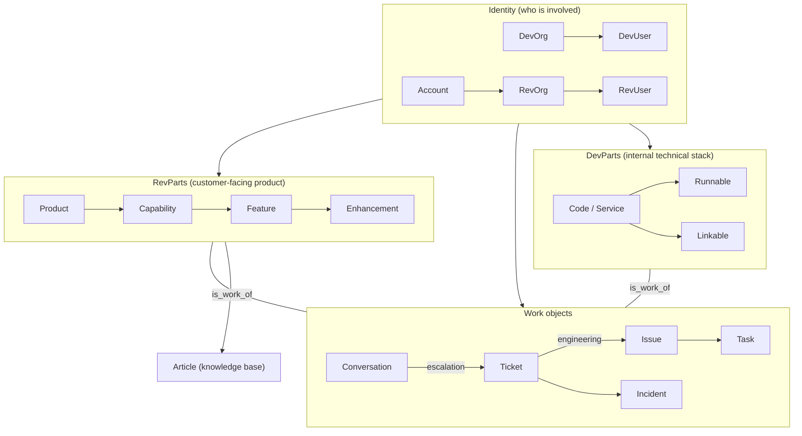

# Object Model Reference

Learn the concepts in [session s03](/en/s03); use this page as a **reference** for diagrams, tables, and link rules.

## Relationship overview

A high-level view of how major object families connect (details may vary by configuration).

## Object list (summary)

Major objects by category. DevUser / RevUser visibility is indicative.

| Category | Object | Description | DevUser | RevUser |
|----------|--------|-------------|---------|---------|
| Identity | DevOrg | Your organization | Yes | No |
| Identity | DevUser | Internal user | Yes | No |
| Identity | Account | Customer record | Yes | No |
| Identity | RevOrg | Customer org unit | Yes | Conditional |
| Identity | RevUser | Customer-side user | Yes | Yes (self) |
| RevParts | Product | Top of product tree | Yes | Yes (ref) |
| RevParts | Capability | Capability area | Yes | Yes (ref) |
| RevParts | Feature | Feature unit | Yes | Yes (ref) |
| RevParts | Enhancement | Improvement theme | Yes | No |
| DevParts | Code / Service | Internal service | Yes | No |
| DevParts | Runnable | Runnable unit | Yes | No |
| DevParts | Linkable | Library / shared | Yes | No |
| Work | Conversation | Chat / discussion | Yes | Yes (own) |
| Work | Ticket | Customer ticket | Yes | Yes (own) |
| Work | Issue | Engineering work item | Yes | No |
| Work | Task | Task | Yes | No |
| Work | Incident | Incident record | Yes | No |
| Other | Article | Knowledge article | Yes | Yes (published) |
| CRM | Opportunity | Sales opportunity | Yes | No |

## Link rules

### Links between different object types

| Source | Target | Link type | Meaning |
|--------|--------|-----------|---------|
| Conversation | Ticket | is_related_to | Tie chat to a ticket |
| Ticket | Issue | is_dependent_on | Ticket drives dependency on Issue |
| Incident | Issue | is_dependent_on | Incident depends on resolving Issue |
| Incident | Ticket | is_dependent_on | Link incident to related tickets |
| Issue | Ticket | is_dependent_on | Dependency between Issue and Ticket |
| Issue / Ticket | Part | is_work_of | Attribute work to a Part |
| Task | Issue / Ticket | is_parent_of / is_child_of | Nest tasks under Issue or Ticket |
| Article | Part | (required) | KB articles attach to a RevPart |
| Account | Issue | not linkable | Route through Ticket |

### Same-type (self) links

| Objects | Link type | Meaning |
|---------|-----------|---------|
| Ticket ↔ Ticket | is_parent_of / is_child_of | Parent / child tickets |
| Ticket ↔ Ticket | is_duplicate_of | Duplicate (duplicate may auto-close) |
| Issue ↔ Issue | is_parent_of / is_child_of | Parent / child Issues |
| Issue ↔ Issue | is_dependent_on | Dependency |
| Issue ↔ Issue | is_duplicate_of | Duplicate Issues |
| Task ↔ Task | is_dependent_on | Task dependency |
| Task ↔ Task | is_duplicate_of | Duplicate tasks |
| Part ↔ Part | is_parent_of / is_child_of | RevPart hierarchy |

### Stock link types

| Link type | Meaning | Typical use |
|-----------|---------|-------------|
| is_parent_of / is_child_of | Parent/child | Ticket, Issue, Part |
| is_dependent_on | Must complete first | Issue, Ticket, Incident |
| is_duplicate_of | Duplicate | Ticket, Issue, Task |
| is_related_to | Loose relation | Conversation ↔ Ticket |
| is_work_of | Work belongs to | Issue/Ticket → Part |
| is_source_of | Origin / derivation | Issue → Issue |
| is_part_of | Composition | Part → Part |

You can also define **custom link types** for your organization.

## Notes for partners and customers

| Point | What it means | Why it helps |
|-------|---------------|--------------|
| Ticket is the bridge | The customer-facing link between RevUsers and DevUsers | Customers do not have to think about internal dev objects |
| Issue is internal | Engineering work items; not a customer UI concept | Experiments stay off the customer-visible surface |
| Account is the ledger | DevUsers manage customer companies; not wired directly to Issues | Customer profile data stays separate from dev backlog mechanics |
| Conversation is the entry | First touch for feedback; can escalate to Ticket | Light questions vs formal cases |
| RevParts vs DevParts | Customer product structure vs internal stack | Show product value without exposing internals |
| Article access levels | Public, internal, restricted, etc. | One KB for both internal docs and customer help |
