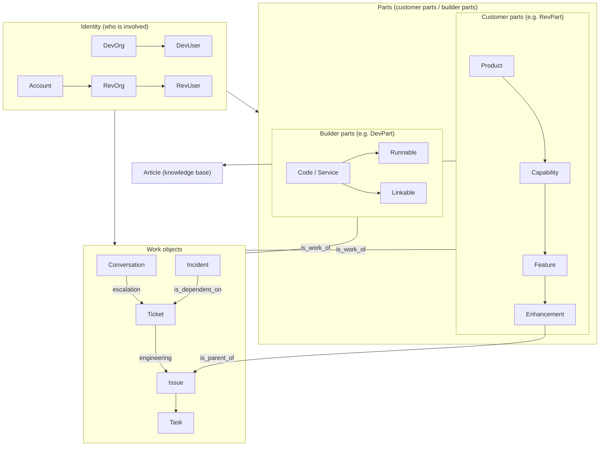

# Object Model Reference

Learn the ideas in [session s03](/en/s03). See [Core concepts](https://support.devrev.ai/devrev/article/ART-21847) for DevRev's overview. This page is a **reference** for diagrams, tables, and link rules.

## Relationship overview

The pillars are **Identity → Parts → Work**. Inside Parts, **customer parts** vs **builder parts** (the product UI often shows RevPart / DevPart). **Enhancement** is a **Part** (customer RevPart) in the **Product → Capability → Feature → Enhancement** chain — it is **not** the same kind of object as **Issue / Ticket** work items. It often behaves as a hybrid: epic-style grouping of Issues, lifecycle, and links to Tickets or opportunities (see [s03](/en/s03)). Issues and Tickets attach to **Parts** with **is_work_of** — not only **Feature** but **Enhancement** can be that Part. **Enhancement** can also be the **is_parent_of** parent of multiple **Issues**. The diagram shows both ideas. **Incident → Ticket** matches the link table below. Details may vary by configuration.



## Object list (summary)

Major objects by category. DevUser / RevUser visibility is indicative.

| Category | Object | Description | DevUser | RevUser |
|----------|--------|-------------|---------|---------|
| Identity | DevOrg | Your organization | Yes | No |
| Identity | DevUser | Internal user | Yes | No |
| Identity | Account | Customer record | Yes | No |
| Identity | RevOrg | Customer org unit | Yes | Conditional |
| Identity | RevUser | Customer-side user | Yes | Yes (self) |
| Parts (customer) | Product | Top of product tree | Yes | Yes (ref) |
| Parts (customer) | Capability | Capability area | Yes | Yes (ref) |
| Parts (customer) | Feature | Feature unit | Yes | Yes (ref) |
| Parts (customer) | Enhancement | Improvement theme (RevPart at end of hierarchy; epic-style parent of Issues) | Yes | No |
| Parts (builder) | Code / Service | Internal service | Yes | No |
| Parts (builder) | Runnable | Runnable unit | Yes | No |
| Parts (builder) | Linkable | Library / shared | Yes | No |
| Work | Conversation | Chat / discussion | Yes | Yes (own) |
| Work | Ticket | Customer ticket | Yes | Yes (own) |
| Work | Issue | Engineering work item | Yes | No |
| Work | Task | Task | Yes | No |
| Work | Incident | Incident record | Yes | No |
| Other | Article | Knowledge article | Yes | Yes (published) |
| CRM | Opportunity | Sales opportunity | Yes | No |

## Link rules

### Links between different object types

| Source | Target | Link type | Meaning |
|--------|--------|-----------|---------|
| Conversation | Ticket | is_related_to | Tie chat to a ticket |
| Ticket | Issue | is_dependent_on | Ticket drives dependency on Issue |
| Incident | Issue | is_dependent_on | Incident depends on resolving Issue |
| Incident | Ticket | is_dependent_on | Link incident to related tickets |
| Issue | Ticket | is_dependent_on | Dependency between Issue and Ticket |
| Issue / Ticket | Part | is_work_of | Attribute work to a Part (**Feature** and **Enhancement** are common targets) |
| Enhancement | Issue | is_parent_of | Enhancement (Part) as epic-style parent of Issues |
| Task | Issue / Ticket | is_parent_of / is_child_of | Nest tasks under Issue or Ticket |
| Article | Part | (required) | KB articles attach to a customer part (often shown as RevPart) |
| Account | Issue | not linkable | Route through Ticket |

### Same-type (self) links

| Objects | Link type | Meaning |
|---------|-----------|---------|
| Ticket ↔ Ticket | is_parent_of / is_child_of | Parent / child tickets |
| Ticket ↔ Ticket | is_duplicate_of | Duplicate (duplicate may auto-close) |
| Issue ↔ Issue | is_parent_of / is_child_of | Parent / child Issues |
| Issue ↔ Issue | is_dependent_on | Dependency |
| Issue ↔ Issue | is_duplicate_of | Duplicate Issues |
| Task ↔ Task | is_dependent_on | Task dependency |
| Task ↔ Task | is_duplicate_of | Duplicate tasks |
| Part ↔ Part | is_parent_of / is_child_of | Customer-part hierarchy, etc. |

### Stock link types

| Link type | Meaning | Typical use |
|-----------|---------|-------------|
| is_parent_of / is_child_of | Parent/child | Ticket, Issue, Part, **Enhancement (Part) → Issue** |
| is_dependent_on | Must complete first | Issue, Ticket, Incident |
| is_duplicate_of | Duplicate | Ticket, Issue, Task |
| is_related_to | Loose relation | Conversation ↔ Ticket |
| is_work_of | Work belongs to | Issue/Ticket → Part (e.g. Feature / **Enhancement**) |
| is_source_of | Origin / derivation | Issue → Issue |
| is_part_of | Composition | Part → Part |

You can also define **custom link types** for your organization.

## Extensibility (custom fields, subtypes, custom objects)

Come back to this section when standard objects are not enough for your process or integration. You do not need to configure everything up front.

When standard objects cannot express a requirement, DevRev offers three extension paths.

### Custom fields

Add fields to existing objects (Ticket, Issue, Account, and others). Configure them in the Settings UI.

```
Example: add "impacted user count" to Ticket
Field name: tnt__impacted_user_count
Type: int
```

- Field names use the `tnt__` prefix (tenant-specific).
- Supported types include text, int, double, bool, enum, timestamp, id (reference to another object), and more.
- For enum, define the allowed values first.

### Subtypes

Define subtypes for an object type (for example Ticket or Issue) to reflect different workflows.

```
Example: Ticket subtypes
- Bug
- Feature request
- Question
```

Each subtype can carry its own custom fields — for example, only the Bug subtype might require "steps to reproduce."

### Custom objects

Model concepts that do not fit standard categories.

```
Example: custom_object.vendor
  - Vendor name (text)
  - Contract period (timestamp)
  - SLA tier (enum)
```

- Custom objects live under the `custom_object.*` namespace.
- They participate in links, search, and dashboards like standard objects.
- You typically create them via API using the same patterns as standard objects.

### Which tool to use

| Goal | Mechanism |
|------|-----------|
| Add a field to Ticket | Custom field |
| Classify Tickets by use case | Subtype |
| Represent a concept that is not a standard object | Custom object |

Configure custom fields under Settings > Object Customization. Creating custom objects is usually done through the API (see [s12](/en/s12)).

## What this design is for

A learner-oriented summary of why the platform splits work across these objects.

| Aspect | What it means | What you gain |
|-------|---------------|--------------|
| Ticket is the bridge | The customer-facing link between RevUsers and DevUsers | Customers do not have to think about internal dev objects |
| Issue is internal | Engineering work items; not a customer UI concept | Experiments stay off the customer-visible surface |
| Account is the ledger | DevUsers manage customer companies; not wired directly to Issues | Customer profile data stays separate from dev backlog mechanics |
| Conversation is the entry | First touch for feedback; can escalate to Ticket | Light questions vs formal cases |
| Customer vs builder parts | Official names for customer-facing vs internal stack | Show product value without exposing internals |
| Article access levels | Public, internal, restricted, etc. | One KB for both internal docs and customer help |
