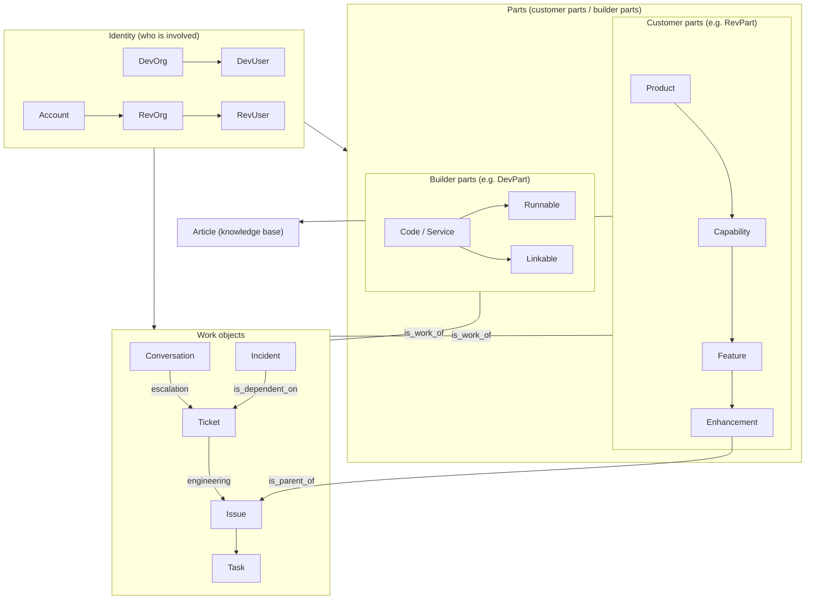

# Object Model Reference

Learn the ideas in [session s03](/en/s03). See [Core concepts](https://support.devrev.ai/devrev/article/ART-21847) for DevRev's overview. This page is a **reference** for diagrams, tables, and link rules.

## Relationship overview

The pillars are **Identity → Parts → Work**.

### Identity / Parts / Work (how to read the diagram)

- **Identity**: who is involved (DevOrg, DevUser, Account, RevOrg, RevUser)
- **Parts**: what the work is about  
  - **Customer parts** are often shown as RevPart in the UI
  - **Builder parts** are often shown as DevPart in the UI
- **Work**: the work objects themselves (Conversation, Ticket, Issue, Task, Incident)

### Enhancement (important nuance)

**Enhancement** is a **Part** (a customer part / RevPart) in the **Product → Capability → Feature → Enhancement** chain — it is **not** the same kind of object as **Issue / Ticket** work items.

However, Enhancement often behaves like a hybrid:

- It can group multiple Issues (epic-style) via **is_parent_of**
- Issues and Tickets attach to Parts via **is_work_of** (both **Feature** and **Enhancement** can be the Part target)

The diagram shows both relationships. The **Incident → Ticket** arrow direction matches the link rules table below. Details can vary by configuration.



## Object list (summary)

Major objects by category. DevUser / RevUser visibility is indicative.

| Category | Object | Description | DevUser | RevUser |
|----------|--------|-------------|---------|---------|
| Identity | DevOrg | Your organization | Yes | No |
| Identity | DevUser | Internal user | Yes | No |
| Identity | Account | Customer record | Yes | No |
| Identity | RevOrg | Customer org unit | Yes | Conditional |
| Identity | RevUser | Customer-side user | Yes | Yes (self) |
| Parts (customer) | Product | Top of product tree | Yes | Yes (ref) |
| Parts (customer) | Capability | Capability area | Yes | Yes (ref) |
| Parts (customer) | Feature | Feature unit | Yes | Yes (ref) |
| Parts (customer) | Enhancement | Improvement theme (RevPart at end of hierarchy; epic-style parent of Issues) | Yes | No |
| Parts (builder) | Code / Service | Internal service | Yes | No |
| Parts (builder) | Runnable | Runnable unit | Yes | No |
| Parts (builder) | Linkable | Library / shared | Yes | No |
| Work | Conversation | Chat / discussion | Yes | Yes (own) |
| Work | Ticket | Customer ticket | Yes | Yes (own) |
| Work | Issue | Engineering work item | Yes | No |
| Work | Task | Task | Yes | No |
| Work | Incident | Incident record | Yes | No |
| Other | Article | Knowledge article | Yes | Yes (published) |
| CRM | Opportunity | Sales opportunity | Yes | No |

## Link rules

### Links between different object types

| Source | Target | Link type | Meaning |
|--------|--------|-----------|---------|
| Conversation | Ticket | is_related_to | Tie chat to a ticket |
| Ticket | Issue | is_dependent_on | Ticket drives dependency on Issue |
| Incident | Issue | is_dependent_on | Incident depends on resolving Issue |
| Incident | Ticket | is_dependent_on | Link incident to related tickets |
| Issue | Ticket | is_dependent_on | Dependency between Issue and Ticket |
| Issue / Ticket | Part | is_work_of | Attribute work to a Part (**Feature** and **Enhancement** are common targets) |
| Enhancement | Issue | is_parent_of | Enhancement (Part) as epic-style parent of Issues |
| Task | Issue / Ticket | is_parent_of / is_child_of | Nest tasks under Issue or Ticket |
| Article | Part | (required) | KB articles attach to a customer part (often shown as RevPart) |
| Account | Issue | not linkable | Route through Ticket |

### Same-type (self) links

| Objects | Link type | Meaning |
|---------|-----------|---------|
| Ticket ↔ Ticket | is_parent_of / is_child_of | Parent / child tickets |
| Ticket ↔ Ticket | is_duplicate_of | Duplicate (duplicate may auto-close) |
| Issue ↔ Issue | is_parent_of / is_child_of | Parent / child Issues |
| Issue ↔ Issue | is_dependent_on | Dependency |
| Issue ↔ Issue | is_duplicate_of | Duplicate Issues |
| Task ↔ Task | is_dependent_on | Task dependency |
| Task ↔ Task | is_duplicate_of | Duplicate tasks |
| Part ↔ Part | is_parent_of / is_child_of | Customer-part hierarchy, etc. |

### Stock link types

| Link type | Meaning | Typical use |
|-----------|---------|-------------|
| is_parent_of / is_child_of | Parent/child | Ticket, Issue, Part, **Enhancement (Part) → Issue** |
| is_dependent_on | Must complete first | Issue, Ticket, Incident |
| is_duplicate_of | Duplicate | Ticket, Issue, Task |
| is_related_to | Loose relation | Conversation ↔ Ticket |
| is_work_of | Work belongs to | Issue/Ticket → Part (e.g. Feature / **Enhancement**) |
| is_source_of | Origin / derivation | Issue → Issue |
| is_part_of | Composition | Part → Part |

You can also define **custom link types** for your organization.

## Extensibility (custom fields, subtypes, custom objects)

Come back to this section when standard objects are not enough for your process or integration. You do not need to configure everything up front.

When standard objects cannot express a requirement, DevRev offers three extension paths.

### Custom fields

Add fields to existing objects (Ticket, Issue, Account, and others). Configure them in the Settings UI.

```
Example: add "impacted user count" to Ticket
Field name: tnt__impacted_user_count
Type: int
```

- Field names use the `tnt__` prefix (tenant-specific).
- Supported types include text, int, double, bool, enum, timestamp, id (reference to another object), and more.
- For enum, define the allowed values first.

### Subtypes

Define subtypes for an object type (for example Ticket or Issue) to reflect different workflows.

```
Example: Ticket subtypes
- Bug
- Feature request
- Question
```

Each subtype can carry its own custom fields — for example, only the Bug subtype might require "steps to reproduce."

### Custom objects

Model concepts that do not fit standard categories.

```
Example: custom_object.vendor
  - Vendor name (text)
  - Contract period (timestamp)
  - SLA tier (enum)
```

- Custom objects live under the `custom_object.*` namespace.
- They participate in links, search, and dashboards like standard objects.
- You typically create them via API using the same patterns as standard objects.

### Which tool to use

| Goal | Mechanism |
|------|-----------|
| Add a field to Ticket | Custom field |
| Classify Tickets by use case | Subtype |
| Represent a concept that is not a standard object | Custom object |

Configure custom fields under Settings > Object Customization. Creating custom objects is usually done through the API (see [s12](/en/s12)).

## Computer Memory architecture

[s01](/en/s01) and [s14](/en/s14) introduced **Computer Memory** as one of the four foundations. This section explains the technical internals. Memory is built on top of the object model documented above.

### What Memory is

Memory is DevRev's **AI-native knowledge graph substrate**. It is not a single database or search index — it is a composed stack of specialized stores that together form a unified data layer.

> "The key architectural question is not which AI model you use — it is what that model is reasoning over."

### Components

Memory comprises the following specialized components. The platform routes queries to the right store depending on the question.

| Component | Purpose |
|-----------|---------|
| Context Registry | Annotations describing the semantics of structured data elements — the "map legend" for AI |
| Data Warehouse | Columnar storage for large-scale analytics (Apache Parquet + Arrow) |
| Relational Database | Transactional, highly structured data |
| Inverted Keyword Index | Powers keyword/syntactic search |
| Vector Database | Stores embeddings for semantic search |
| Graph Database | Stores relationships and connections between entities |
| Permissions Store | Maintains permission mapping for every entity, field, and user |
| Time Series Database | Time-indexed data for temporal analysis and "time travel" |

### "Searching" vs "remembering"

Typical AI systems (RAG) search for documents and have an LLM synthesise an answer. Computer Memory takes a fundamentally different approach.

| Dimension | Typical RAG | Computer Memory |
|-----------|-------------|-----------------|
| Query path | Document retrieval → LLM synthesis | NL → SQL → deterministic result |
| Reproducibility | Probabilistic (same question may yield different answers) | Deterministic (same question, same answer) |
| Token cost | Scales with retrieval volume | Scales with result set size (not source data size) |
| Freshness | Depends on crawl cycle (minutes to hours) | Continuous CDC, immediate |

The query execution path:

```
User question
  → GetKGSchema (identify relevant node types)
  → GetNodeSchema (get field definitions)
  → NLToSQL (convert natural language to SQL)
  → ExecuteSQL (return structured result)
  → Answer generation
```

The LLM does not guess from retrieved documents — it executes a deterministic query and reads the result. This is the core difference between "searching" and "remembering."

### The ontology: pre-built, not inferred

Memory ships with a **pre-built ontology** for the customer-product-engineering domain. When integrations (AirSync) bring data in, the platform already knows what a customer account, support ticket, product part, and engineering issue are and how they relate.

This is the same object model documented at the top of this page:

- **Product hierarchy:** Product → Capability → Feature → Enhancement
- **Work objects:** Issue, Ticket, Incident, Conversation
- **Customer objects:** Account, RevOrg, RevUser
- **Relationships:** depends, duplicates, owns, creates, belongs, fixes, implements, improves

These relationships are first-class entities in the graph — not inferred at query time.

### AirSync: how data enters Memory

AirSync (formerly Airdrop) is the bidirectional sync engine. It connects 50+ tools (Salesforce, Jira, Zendesk, Slack, GitHub, Google Workspace, and more) to Memory.

| Property | Description |
|----------|-------------|
| Schema fidelity | Composable schema fragments mirror source systems including conditional logic, stage constraints, and field dependencies |
| Identity model | Source system ACLs enforced at the platform level with zero performance penalty |
| Sync model | Stateless incremental sync maintaining referential integrity |
| Write safety | Full-fidelity structure + permissions intact → safe and auditable write-back to systems of record |

### Decoupled from any specific LLM

Memory does not depend on a particular LLM.

- Structured queries (SQL) execute without an LLM
- The LLM is used to convert natural language to SQL and to format results for humans
- Switching LLM providers has no impact on the Memory layer
- Customer data is never used for LLM training

### Context Registry: the "map legend" for AI

The Context Registry is one of Memory's most important components.

Raw database schemas alone do not tell AI the difference between a "ticket ID" and a "user ID." The Context Registry annotates schemas with field descriptions, allowed values, and semantic context — enabling agents to understand data and make autonomous decisions.

This is what powers NL-to-SQL accuracy.

### Where this section fits

| Where | What |
|-------|------|
| [s01](/en/s01) | Overview of Computer's four foundations (AirSync, Memory, Foundational Services, Agent Studio) |
| [s03](/en/s03) | The Identity / Parts / Work data model |
| This section | Memory technical architecture |
| [s14](/en/s14) | How Agent Studio uses Memory |

---

## What this design is for

A learner-oriented summary of why the platform splits work across these objects.

| Aspect | What it means | What you gain |
|-------|---------------|--------------|
| Ticket is the bridge | The customer-facing link between RevUsers and DevUsers | Customers do not have to think about internal dev objects |
| Issue is internal | Engineering work items; not a customer UI concept | Experiments stay off the customer-visible surface |
| Account is the ledger | DevUsers manage customer companies; not wired directly to Issues | Customer profile data stays separate from dev backlog mechanics |
| Conversation is the entry | First touch for feedback; can escalate to Ticket | Light questions vs formal cases |
| Customer vs builder parts | Official names for customer-facing vs internal stack | Show product value without exposing internals |
| Article access levels | Public, internal, restricted, etc. | One KB for both internal docs and customer help |
