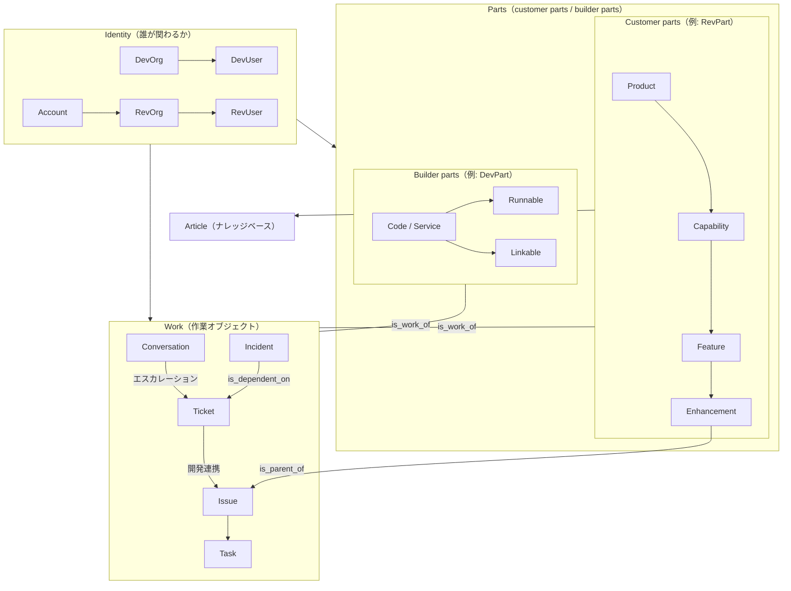

# オブジェクト構造リファレンス

チュートリアルでは [s03](/ja/s03) で概念を学ぶ。公式の全体説明は [Core concepts](https://support.devrev.ai/devrev/article/ART-21847)。このページは **一覧・図・リンクルール** をいつでも引けるリファレンスである。

## 全体リレーション図

3本柱は **Identity → Parts → Work** である。

### Identity / Parts / Work（図の読み方）

- **Identity**: 誰が関わるか（DevOrg / DevUser / Account / RevOrg / RevUser）
- **Parts**: 何についての作業か  
  - customer parts は UI で RevPart と表示されることが多い
  - builder parts は UI で DevPart と表示されることが多い
- **Work**: 作業オブジェクト（Conversation / Ticket / Issue / Task / Incident）

### Enhancement（重要な注意点）

**Enhancement** は **Part（customer part / RevPart）** として **Product → Capability → Feature → Enhancement** の階層に属する（**Issue / Ticket そのものではない**）。

一方で Enhancement は、次のように **Work に近い振る舞い**も併せ持つ（[s03](/ja/s03) 参照）。

- **is_parent_of** により、複数 Issue を束ねる（Epic 的なまとまり）
- Issue / Ticket は **is_work_of** で Part に帰属する（**Feature** だけでなく **Enhancement** が帰属先になることもある）

図ではこの2つを示している。**Incident → Ticket** の向きは下記リンクルール表と一致させている。詳細は製品の設定により異なる場合がある。



## 全オブジェクト一覧（概要）

主要オブジェクトをカテゴリ別に示す。DevUser / RevUser の可視性は目安である。

| カテゴリ | オブジェクト | 説明 | DevUser | RevUser |
|---------|---------------|------|---------|---------|
| Identity | DevOrg | 自社組織 | ○ | × |
| Identity | DevUser | 自社ユーザー | ○ | × |
| Identity | Account | 顧客台帳 | ○ | × |
| Identity | RevOrg | 顧客組織単位 | ○ | 条件付き |
| Identity | RevUser | 顧客側ユーザー | ○ | ○（本人） |
| Parts（customer） | Product | 製品最上位 | ○ | ○（参照） |
| Parts（customer） | Capability | 機能領域 | ○ | ○（参照） |
| Parts（customer） | Feature | 個別機能 | ○ | ○（参照） |
| Parts（customer） | Enhancement | 改善テーマ（階層末端の RevPart。Issue を束ねる Epic 的役割も） | ○ | × |
| Parts（builder） | Code / Service | 内部サービス | ○ | × |
| Parts（builder） | Runnable | 実行可能サービス | ○ | × |
| Parts（builder） | Linkable | ライブラリ等 | ○ | × |
| Work | Conversation | チャット・議論 | ○ | ○（自分） |
| Work | Ticket | 顧客チケット | ○ | ○（自分） |
| Work | Issue | 開発課題 | ○ | × |
| Work | Task | タスク | ○ | × |
| Work | Incident | インシデント | ○ | × |
| その他 | Article | ナレッジ（[権限制御の詳細](/ja/article-access-control)） | ○ | ○（公開分） |
| CRM | Opportunity | 商談 | ○ | × |

## リンクルール

### 異なるオブジェクト間のリンク

| ソース | ターゲット | リンクタイプ | 説明 |
|--------|-----------|------------|------|
| Conversation | Ticket | is_related_to | チャットをチケットに紐づける |
| Ticket | Issue | is_dependent_on | チケットが起点で Issue に依存 |
| Incident | Issue | is_dependent_on | インシデントが解決すべき Issue に依存 |
| Incident | Ticket | is_dependent_on | インシデントと関連チケットを紐づける |
| Issue | Ticket | is_dependent_on | Issue と Ticket の依存関係（双方向の使い方あり） |
| Issue / Ticket | Part | is_work_of | 作業を Part に紐づける（**Part** には Feature などに加え **Enhancement** も含む） |
| Enhancement | Issue | is_parent_of | Enhancement（Part）が複数 Issue の親になる Epic 的まとまり |
| Task | Issue / Ticket | is_parent_of / is_child_of | タスクを Issue・Ticket の子として紐づける |
| Article | Part | （必須紐づけ） | KB は customer part（多くは RevPart）に紐づける |
| Account | Issue | リンク不可 | 必ず Ticket を経由すること |

### 同一オブジェクト間（自己参照）

| オブジェクト | リンクタイプ | 説明 |
|-------------|------------|------|
| Ticket ↔ Ticket | is_parent_of / is_child_of | 親子チケット |
| Ticket ↔ Ticket | is_duplicate_of | 重複チケット（重複側は自動クローズ） |
| Issue ↔ Issue | is_parent_of / is_child_of | 親子 Issue（親は 1 つのみ等、運用ルールに従う） |
| Issue ↔ Issue | is_dependent_on | 依存関係 |
| Issue ↔ Issue | is_duplicate_of | 重複 Issue |
| Task ↔ Task | is_dependent_on | タスク間依存 |
| Task ↔ Task | is_duplicate_of | 重複タスク |
| Part ↔ Part | is_parent_of / is_child_of | customer part 階層など |

### ストックリンクタイプ一覧

| リンクタイプ | 意味 | 主な用途 |
|-------------|------|---------|
| is_parent_of / is_child_of | 親子関係 | Ticket, Issue, Part、**Enhancement（Part）→ Issue** |
| is_dependent_on | 依存関係（先に完了が必要） | Issue, Ticket, Incident |
| is_duplicate_of | 重複（重複側は自動クローズ） | Ticket, Issue, Task |
| is_related_to | 関連（緩やかなつながり） | Conversation↔Ticket |
| is_work_of | 作業の帰属先 | Issue/Ticket → Part（Feature / **Enhancement** など） |
| is_source_of | 起源・派生元 | Issue → Issue |
| is_part_of | 構成要素 | Part → Part |

カスタムリンクタイプを独自に定義することも可能である。

## 拡張の仕組み（カスタムフィールド・サブタイプ・カスタムオブジェクト）

設計や API 連携の途中で「標準オブジェクトだけでは足りない」と感じたときに戻って読むセクションである。いますべてを設定する必要はない。

DevRev の標準オブジェクトでは表現しきれない業務要件がある場合、以下の 3 つの拡張手段を使う。

### カスタムフィールド

既存オブジェクト（Ticket, Issue, Account など）にフィールドを追加する。UI の Settings 画面から設定可能。

```
例: Ticket に「影響ユーザー数」フィールドを追加
フィールド名: tnt__impacted_user_count
型: int
```

- フィールド名には `tnt__` プレフィックスが付く（テナント固有を意味する）。
- 型は text, int, double, bool, enum, timestamp, id（他オブジェクト参照）などが使用可能。
- enum 型は選択肢をあらかじめ定義する。

### サブタイプ

既存のオブジェクトタイプ（Ticket, Issue など）に対して、用途別のサブタイプを定義する。

```
例: Ticket のサブタイプ
- Bug（バグ報告）
- Feature Request（機能要望）
- Question（質問）
```

サブタイプごとに異なるカスタムフィールドを持たせることができる。たとえば Bug サブタイプにのみ「再現手順」フィールドを追加する、といった設計が可能。

### カスタムオブジェクト

標準のオブジェクトカテゴリに収まらない概念をモデル化する場合に使う。

```
例: custom_object.vendor（ベンダー管理）
  - ベンダー名（text）
  - 契約期間（timestamp）
  - SLA レベル（enum）
```

- カスタムオブジェクトは `custom_object.xxx` という名前空間で管理される。
- 標準オブジェクトと同様にリンクで接続でき、検索やダッシュボードの対象にもなる。
- API からの操作も標準オブジェクトと同じパターンで行える。

### 使い分けの指針

| やりたいこと | 手段 |
|-------------|------|
| Ticket に項目を追加したい | カスタムフィールド |
| Ticket を用途別に分類したい | サブタイプ |
| 既存オブジェクトに当てはまらない概念を追加したい | カスタムオブジェクト |

カスタムフィールドの設定方法は Settings > Object Customization から行う。カスタムオブジェクトの作成は API 経由で行う（[s12](/ja/s12) 参照）。

## Computer Memory アーキテクチャ

[s01](/ja/s01) と [s14](/ja/s14) で触れた **Computer Memory** の技術的な仕組みを整理する。Memory はオブジェクト構造（上記リファレンス）の上に構築されている。

### Memory とは何か

Memory は DevRev の **AI ネイティブなナレッジグラフ基盤**である。単なるデータベースや検索インデックスではなく、複数の専門ストアを組み合わせた統合データレイヤーである。

> 「重要なのは、どの AI モデルを使うかではなく、そのモデルが何を推論の対象としているかである。」

### 構成要素

Memory は以下の専門コンポーネントで構成されている。プラットフォームがクエリの種類に応じて適切なストアにルーティングする。

| コンポーネント | 役割 |
|--------------|------|
| Context Registry | 構造化データの意味（セマンティクス）を記述するアノテーション層。AI がフィールドの意味を理解するための「地図の凡例」 |
| Data Warehouse | 大規模分析向けの列指向ストレージ（Apache Parquet + Arrow） |
| Relational Database | トランザクション整合性が求められる構造化データ |
| Inverted Keyword Index | キーワード検索（構文的検索） |
| Vector Database | セマンティック検索用のベクトル埋め込み |
| Graph Database | エンティティ間の関係性とリンク |
| Permissions Store | すべてのエンティティ・フィールド・ユーザーに対する権限マッピング |
| Time Series Database | 時系列データの分析と「タイムトラベル」 |

### 「検索する」と「記憶している」の違い

一般的な AI システム（RAG）は、ドキュメントを検索して LLM が回答を合成する。DevRev の Memory は異なるアプローチを取る。

| 観点 | 一般的な RAG | Computer Memory |
|------|-------------|----------------|
| クエリパス | ドキュメント検索 → LLM が合成 | NL → SQL → 決定論的な結果 |
| 再現性 | 確率的（同じ質問でも回答が変わりうる） | 決定論的（同じ質問には同じ回答） |
| トークンコスト | 検索結果の量に比例 | 結果セットの量に比例（ソースデータ量に非依存） |
| 鮮度 | クロールサイクルに依存（分〜時間） | 継続的な CDC（Change Data Capture）による即時反映 |

Memory のクエリ実行パスは以下のようになる。

```
ユーザーの質問
  → GetKGSchema（関連するノード種別を特定）
  → GetNodeSchema（フィールド定義を取得）
  → NLToSQL（自然言語を SQL に変換）
  → ExecuteSQL（構造化された結果を返す）
  → 回答生成
```

LLM がドキュメントから推測するのではなく、構造化データに対して決定論的なクエリを実行し、その結果を読み上げる——これが「検索する」と「記憶している」の本質的な違いである。

### オントロジー: 事前定義されたデータモデル

Memory のナレッジグラフは **事前定義されたオントロジー** を持つ。インテグレーション（AirSync）がデータを取り込む時点で、プラットフォームは「顧客アカウント」「サポートチケット」「プロダクトパーツ」「エンジニアリング Issue」が何であり、それらがどう関係するかを既に知っている。

これはこのページ上部で整理したオブジェクト構造そのものである。

- **Product 階層**: Product → Capability → Feature → Enhancement
- **Work オブジェクト**: Issue, Ticket, Incident, Conversation
- **Customer オブジェクト**: Account, RevOrg, RevUser
- **関係性**: depends, duplicates, owns, creates, belongs, fixes, implements, improves

これらの関係はクエリ時に推論されるのではなく、グラフ上のファーストクラスのエンティティとして永続的に保持されている。

### AirSync: データが Memory に入る仕組み

AirSync（旧 Airdrop）は外部システムとの双方向同期エンジンである。50 以上のツール（Salesforce, Jira, Zendesk, Slack, GitHub, Google Workspace 等）からデータを Memory に取り込む。

| 特性 | 説明 |
|------|------|
| スキーマ忠実性 | ソースシステムの条件ロジック、ステージ制約、フィールド依存関係を含むコンポーザブルなスキーマフラグメントで再現 |
| 権限モデル | ソースシステムの ACL をプラットフォームレベルで保持。パフォーマンスペナルティなし |
| 同期方式 | ステートレスな増分同期。参照整合性を維持 |
| 書き戻し安全性 | 権限と構造を完全保持した、監査可能な System of Record への書き戻し |

### LLM との疎結合

Memory は特定の LLM に依存しない設計である。

- 構造化クエリ（SQL）の実行に LLM は不要
- LLM はユーザーの自然言語を SQL に変換する部分と、結果を人間向けに整形する部分で使用される
- LLM プロバイダーを切り替えても Memory 層は影響を受けない
- 顧客データは LLM のトレーニングに使用されない

### Context Registry: AI のための「地図の凡例」

Context Registry は Memory の中でも特に重要なコンポーネントである。

生のデータベーススキーマだけでは、AI は「チケット ID」と「ユーザー ID」の区別がつかない。Context Registry はスキーマにアノテーション（フィールドの説明、許容値、セマンティクスの文脈）を付与し、エージェントが自律的にデータを理解して判断できるようにする。

これが NL → SQL 変換の精度を支えている仕組みである。

### このセクションの位置づけ

| 学習場所 | 内容 |
|---------|------|
| [s01](/ja/s01) | Computer の 4 基盤の概要（AirSync / Memory / Foundational Services / Agent Studio） |
| [s03](/ja/s03) | Identity / Parts / Work のデータモデル |
| このセクション | Memory の技術アーキテクチャ詳細 |
| [s14](/ja/s14) | Agent Studio がどのように Memory を利用するか |

---

## このモデルの狙い

オブジェクトがなぜこのように分かれているか、学習用の観点で整理した。

| 観点 | 説明 | こう設計すると |
|---------|------|-------------------|
| Ticket は橋渡し役 | RevUser と DevUser をつなぐ顧客向けの接点 | 顧客は内部の開発用オブジェクトを意識しにくい |
| Issue は内部専用 | 開発チームの作業単位。顧客に見せない設計 | 試行錯誤を顧客に見せずに済む |
| Account は管理台帳 | DevUser が顧客企業を管理。Issue とは直接つながらない | 顧客情報と開発タスクが意図せず混ざりにくい |
| Conversation は入口 | 顧客の声の受け口。Ticket に昇格できる | 軽い相談とフォーマル対応を段階的に分けられる |
| Customer / builder parts | 顧客向け構成と内部技術を分離（公式の言い方） | 顧客には製品の見え方だけを伝えやすい |
| Article はアクセス制御 | 公開・内部・非公開などレベルで制御（[詳細](/ja/article-access-control)） | 社内ドキュメントと顧客向けヘルプを同一基盤で管理できる |
